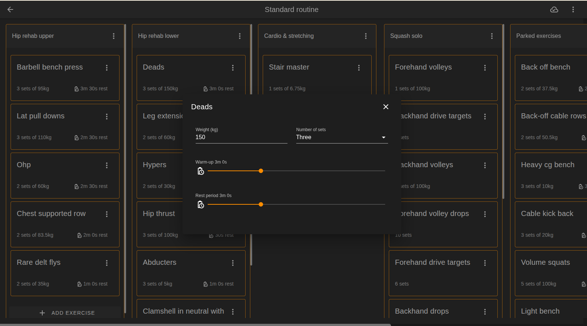
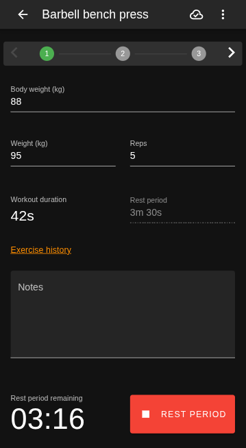
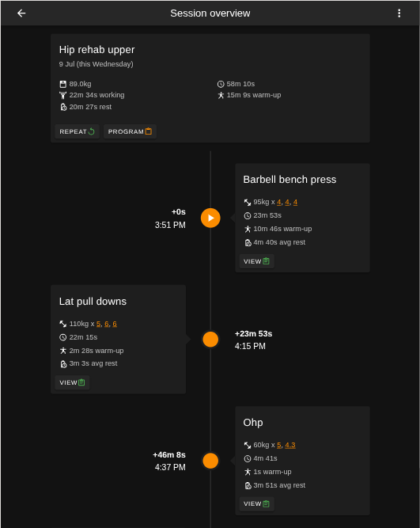

# Lift Tracker
The purpose of this project is twofold:

1. A place for me to learn tech that I don't use in my day job.
2. A way to track my gym "progress" in the exact way I like.

## Features
- Program builder
- Step through session tracking
- Offline support
- Theming

## Live site

### [https://lift-tracker.app/](https://lift-tracker.app/)

## Built With
- Vue / Vuetify / Vuex - SPA frontend
- Dotnet 9 (C#) / ASP MVC / EF Core - API backend
- MySQL - DB
- Auth0 - Authentication

## Getting Started
- [Vue App](./readme/vue-app-frontend-quick-start.md)
- [Dotnet API](./LiftTrackerApi/README.md)
- [MySQL](./LiftTrackerApi/Docker/mysql/README.md)

## License
This project is licensed under the [GNU General Public License v3.0](https://www.gnu.org/licenses/gpl-3.0.en.html).
